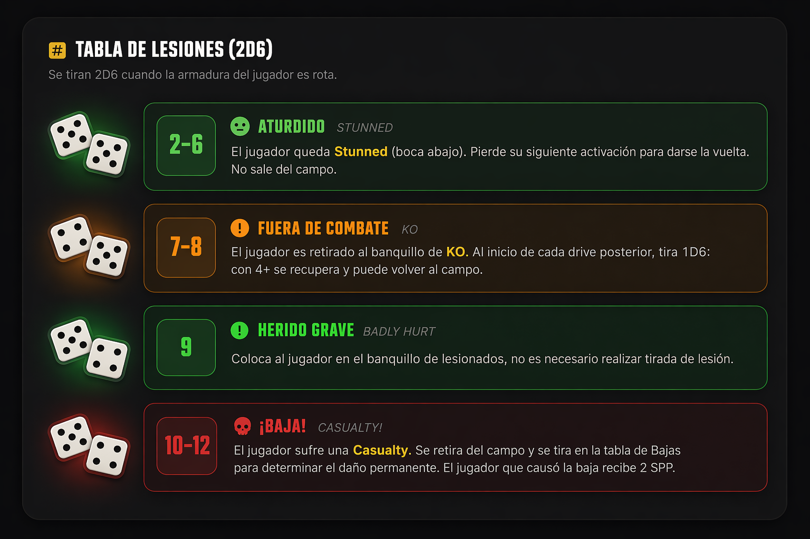

# Blood Bowl League Manager Frontend

## Modelo de despliegue (GitHub Actions + Cloudflare Pages)

Este proyecto se despliega automaticamente a Cloudflare Pages cuando hay un push a la rama `main` mediante el workflow [.github/workflows/deploy.yml](.github/workflows/deploy.yml).

### Flujo de despliegue

1. Se hace `push` a `main`.
2. GitHub Actions ejecuta el job `deploy` en `ubuntu-latest`.
3. Se instala Flutter `3.29.0` (canal `stable`).
4. Se instalan dependencias con `flutter pub get`.
5. Se genera codigo con `build_runner`:

- `flutter pub run build_runner build --delete-conflicting-outputs`

6. Se construye la version web en modo release:

- `flutter build web --release`

7. Se publica en Cloudflare Pages con Wrangler:

- `pages deploy build/web --project-name=blood-bowl-manager-front --commit-dirty=true`

### Trigger actual

- Evento: `push`
- Rama: `main`

No hay despliegues automaticos para ramas de feature ni para pull requests con la configuracion actual.

### Requisitos en GitHub (Secrets)

Configurar estos secrets en el repositorio (`Settings > Secrets and variables > Actions`):

- `CLOUDFLARE_ACCOUNT_ID`
- `CLOUDFLARE_API_TOKEN`

Permisos recomendados para el token de Cloudflare:

- `Cloudflare Pages: Edit`
- `Account: Read` (si aplica segun politica de la cuenta)

### Requisitos en Cloudflare Pages

1. Crear el proyecto Pages con nombre exacto: `blood-bowl-manager-front`.
2. El despliegue lo hace GitHub Actions via API (Wrangler), por lo que el build principal ocurre en Actions.
3. La carpeta publicada es `build/web` (salida de `flutter build web --release`).

### Modelo de entorno

- Produccion: despliegue directo desde `main`.
- Estrategia: CI/CD simple de una sola via (single-branch release).

Esto implica que cualquier merge/push en `main` impacta directamente en el sitio publicado.

### Operacion y verificacion

Despues de cada push a `main`:

1. Revisar ejecucion en `Actions` dentro de GitHub.
2. Confirmar que el job `Deploy to Cloudflare Pages` termina en estado `success`.
3. Validar en Cloudflare Pages que se genero un nuevo deployment.
4. Hacer smoke test rapido del sitio (carga inicial, rutas principales y assets).

### Rollback recomendado

Si un despliegue falla funcionalmente:

1. Revertir el commit en `main`.
2. Hacer push del revert.
3. El workflow vuelve a ejecutar y publica la version previa estable.

### Despliegue manual (opcional, desde local)

Solo para casos puntuales. El flujo oficial es por GitHub Actions.

```bash
flutter pub get
flutter pub run build_runner build --delete-conflicting-outputs
flutter build web --release
npx wrangler pages deploy build/web --project-name=blood-bowl-manager-front
```

## Deuda técnica (hallazgos del análisis estático)

Problemas identificados con `flutter analyze` (808 issues: 0 errores, 143 warnings, 665 infos) y revisión manual del código. Ordenados por prioridad.

---

### 🔴 Crítico

#### 1. `use_build_context_synchronously` en `player_card_screen.dart` [RESUELTO]

**Riesgo:** crash en producción si el widget se desmonta mientras espera un `await`.
**Fichero:** `lib/features/roster/presentation/screens/player_card_screen.dart` — líneas 170, 180, 521, 529.
**Fix:** añadir `if (!mounted) return;` inmediatamente después de cada `await`, antes de cualquier uso de `context` o `ref`.

```dart
await someAsyncCall();
if (!mounted) return;   // <-- añadir esto
ScaffoldMessenger.of(context).showSnackBar(...);
```

#### 2. Cero tests reales

**Riesgo:** cualquier refactor puede romper funcionalidad sin que haya red de seguridad.
**Fichero:** `test/widget_test.dart` — solo contiene `expect(true, isTrue)`.
**Fix mínimo:** añadir tests unitarios para `AuthNotifier` (login/logout/error) y `LeagueRepository`, y al menos un widget test para `PlayerRow`.

---

### 🟠 Importante

#### 3. Estilos tipográficos hardcodeados en todos los screens (DRY crítico)

**Problema:** cada pantalla declara `TextStyle(fontSize: X)` inline, con los mismos valores repetidos en 20+ ficheros. Si se quiere cambiar el tamaño de una etiqueta de sección hay que editar ~15 ficheros.
**Evidencia:** `team_creator_screen.dart` tiene 70 apariciones de `fontSize:`, `my_team_detail_screen.dart` tiene 63, `aftermatch_screen.dart` tiene 52.
**Fix:** usar `Theme.of(context).textTheme.*` que ya está definido en `AppTheme.darkTheme`. Mapeo propuesto:

- `fontSize: 36` → `textTheme.displayMedium`
- `fontSize: 20–18` → `textTheme.titleMedium`
- `fontSize: 13` → `textTheme.bodyMedium`
- `fontSize: 12–11` → `textTheme.bodySmall`

#### 4. `AppTextStyles` duplica la escala tipográfica de `AppTheme` con valores distintos [RESUELTO]

**Ficheros:** `lib/core/theme/app_colors.dart` (antes `AppTextStyles`, ahora `AppTypography`) vs `lib/core/theme/app_theme.dart` (textTheme).
**Problema:** `bodySmall` es `fontSize: 15` en `AppTextStyles` pero `fontSize: 13` en `textTheme`. Dos fuentes de verdad para lo mismo.
**Estado actual:** eliminada la escala duplicada. `AppTypography` conserva solo familias tipográficas y los usos de `displayLarge`/`displayMedium`/`displaySmall` ya salen de `Theme.of(context).textTheme`.

#### 5. Pantallas wiki sin abstracción de layout (copias casi exactas) [RESUELTO]

**Ficheros:** `wiki_weather_screen.dart`, `wiki_blocking_screen.dart`, `wiki_passing_screen.dart`, `wiki_injuries_screen.dart`, `wiki_skills_screen.dart`.
**Problema:** misma estructura (cabecera, grid de tarjetas, descripción rica, tooltip de dados) repetida en cada fichero. Mismo `TextStyle(fontSize: 18)`, mismo `BorderRadius.circular(8)`, mismos colores.
**Estado actual:** extraído `lib/features/wiki/presentation/widgets/wiki_page_layout.dart` y conectado el layout compartido en las pantallas wiki principales. La cabecera común y el escalado de contenido quedan centralizados y cada pantalla solo aporta su contenido específico.

#### 6. `BorderRadius` hardcodeado sin constantes compartidas

**Problema:** `BorderRadius.circular(8)`, `BorderRadius.circular(12)`, `BorderRadius.circular(4)` aparecen 14–32 veces por fichero sin ninguna constante.
**Fix:** añadir en `lib/core/theme/` un `app_dimensions.dart`:

```dart
abstract class AppDimensions {
  static const double radiusXs = 4;
  static const double radiusSm = 8;
  static const double radiusMd = 12;
  static const double radiusLg = 16;
}
```

#### 7. God files — ficheros con responsabilidades múltiples [RESUELTO]

- `lib/features/shared/data/repositories.dart` (942 líneas): contiene `LeagueRepository`, `TeamRepository` y `QuickMatchRepository` juntos. Separar en tres ficheros independientes. [RESUELTO]
  Estado actual: extraído en `league_repository.dart`, `team_repository.dart` y `quick_match_repository.dart`, dejando `repositories.dart` como barrel de compatibilidad para no romper imports existentes.
- `lib/core/shell/app_shell.dart` (617 líneas): sidebar desktop, bottom nav mobile, drawer, header y lógica de navegación mezclados. Extraer `SideNav`, `BottomNav`, `AppDrawer`, `AppShellHeader` como widgets propios. [RESUELTO]
  Estado actual: extraídos widgets propios en `lib/core/shell/widgets/app_shell_navigation_widgets.dart`, dejando `AppShell` centrado en orquestar estado y navegación.
- `lib/features/team_creator/presentation/screens/team_creator_screen.dart` (>2500 líneas): extraer cada paso del wizard en su propio widget. [RESUELTO]
  Estado actual: extraídos `TeamCreatorRaceStep`, `TeamCreatorRosterStep` y `TeamCreatorConfirmStep`, dejando la pantalla principal centrada en estado, navegación del wizard y composición.

#### 8. Índices de navegación mágicos en `app_shell.dart` [RESUELTO]

**Fichero:** `lib/core/shell/app_shell.dart` — función `_resolveSelectedIndex`.
**Problema:** mapeo de rutas a índices 0–17 con números literales y solo comentarios como documentación.
**Estado actual:** el mapeo ya usa constantes compartidas nombradas mediante `AppShellNavIndexes`, reutilizadas tanto por `app_shell.dart` como por los widgets de navegación extraídos.

#### 9. `invalid_annotation_target` — 35 warnings en `team.dart` [RESUELTO]

**Fichero:** `lib/features/roster/domain/models/team.dart`.
**Problema:** `@JsonKey` colocado en posición incompatible con la versión actual de `freezed_annotation`. Genera warnings en toda compilación.
**Estado actual:** eliminadas las anotaciones `@JsonKey` sobre parámetros del factory en `team.dart`. La compatibilidad entre payloads del backend y nombres internos del modelo se resuelve ahora normalizando el JSON en los `fromJson`, evitando los `invalid_annotation_target` sin depender de ignorarlos en el analizador.

#### 10. Código muerto en `team_creator_screen.dart` [RESUELTO]

**Fichero:** `lib/features/team_creator/presentation/screens/team_creator_screen.dart`.
**Problema:** funciones `_buildVerticalSteps`, `_buildRecruitedPlayer` y `_buildStaffStep` definidas pero nunca llamadas.
**Estado actual:** eliminadas las funciones sin uso que quedaban tras la extracción del wizard, dejando `team_creator_screen.dart` sin helpers muertos reportados por el analizador. En una pasada adicional de código muerto también se limpiaron residuos sin uso en `player_row.dart` y `leagues_screen.dart`.

---

### 🟡 Mejora

#### 11. `.withOpacity()` deprecado — ~50 usos en todo el proyecto

**Problema:** `Color.withOpacity()` está deprecado en Flutter 3.x. El linter genera info en cada uso.
**Fix masivo:** reemplazar `color.withOpacity(0.5)` por `color.withValues(alpha: 0.5)` en todos los ficheros. Se puede hacer con un sed o búsqueda global en el IDE.

#### 12. Doble estado de carga en `AuthNotifier`

**Fichero:** `lib/features/auth/data/providers/auth_provider.dart`.
**Problema:** `AuthState` tiene campos `isLoading` y `error` propios, Y además está envuelto en `AsyncValue<AuthState>` que también tiene loading/error. Dos capas redundantes para lo mismo.
**Fix:** o eliminar los campos `isLoading`/`error` de `AuthState` y usar solo `AsyncValue`, o desenvover a un `StateProvider<AuthState>` simple sin `AsyncValue`.

#### 13. Imports y variables locales sin usar [RESUELTO]

**Fichero principal:** `lib/features/roster/presentation/widgets/player_row.dart`.
**Problema:** importa `translations.dart` y hace `watch(localeProvider)` asignando a `lang`, pero `lang` nunca se usa en ese widget.
**Estado actual:** eliminados el import sin uso y el `ref.watch(localeProvider)` innecesario en `player_row.dart`.

#### 14. Sistema i18n custom no escalable

**Fichero:** `lib/core/l10n/translations.dart`.
**Problema:** todas las traducciones en un `const Map` con claves string. No hay comprobación en tiempo de compilación, añadir un idioma nuevo es muy manual, y no hay soporte para plurales.
**Fix a largo plazo:** migrar a `flutter_localizations` + ARB files, o al menos añadir type-safe keys con un enum.

## Analisis 5.5

Revision manual adicional del frontend centrada en buenas practicas, olores de codigo y defectos de implementacion observables en la base actual.

### 1. Modelos de dominio con errores reales de compilacion

**Ficheros:** `lib/features/auth/domain/models/user.dart`, `lib/features/league/domain/models/league.dart`.

**Problema:** varios modelos Freezed usan `@JsonKey` directamente sobre parametros del factory y el analizador reporta errores del tipo `The annotation 'JsonKey.new' can only be used on fields or getters`.

**Impacto:** no es solo deuda tecnica; parte del dominio queda mal definida para la toolchain actual y rompe la fiabilidad del proyecto.

**Recomendacion:** unificar la estrategia de serializacion para Freezed/JsonSerializable y adaptar esos modelos a una unica convencion compatible con la version actual de las dependencias.

### 2. Ruta rota en la navegacion de ligas

**Ficheros:** `lib/features/leagues/presentation/screens/leagues_screen.dart`, `lib/core/router/app_router.dart`.

**Problema:** en `LeaguesScreen` se navega a `/teams/create`, pero la ruta declarada en `GoRouter` es `/create-team`.

**Impacto:** el boton de crear equipo puede fallar en runtime y da una señal clara de falta de verificacion de flujos basicos de navegacion.

**Recomendacion:** centralizar paths o nombres de rutas en constantes o helpers tipados para evitar desajustes entre pantallas y router.

### 3. Cliente HTTP con logging sensible y refresh incompleto

**Fichero:** `lib/core/network/api_client.dart`.

**Problema:** `LogInterceptor` esta activo con `requestBody` y `responseBody` a `true` para todas las peticiones, incluyendo autenticacion. Ademas, en el refresh solo se persiste el nuevo `access_token`, ignorando una posible rotacion del `refresh_token`.

**Impacto:** riesgo de exponer credenciales o tokens en logs y de dejar sesiones en un estado inconsistente si el backend rota ambos tokens.

**Recomendacion:** limitar el logging a entornos de desarrollo y encapsular el refresh de sesion en una politica completa y testeada.

### 4. Mapeo incorrecto en standings de liga

**Fichero:** `lib/features/shared/data/league_repository.dart`.

**Problema:** `getLeagueStandings()` devuelve `Future<List<LeagueTeam>>`, pero parsea datos que conceptualmente corresponden a `LeagueStanding`, modelo que ya existe en el dominio.

**Impacto:** el contrato del repositorio no refleja la semantica real de la API y aumenta la probabilidad de bugs silenciosos o UI mal alimentada.

**Recomendacion:** devolver el tipo correcto, revisar el shape esperado del endpoint y cubrir ese parsing con tests unitarios.

### 5. Uso excesivo de `Map<String, dynamic>` en lugar de modelos tipados

**Ficheros:** especialmente `lib/features/shared/data/team_repository.dart` y varias pantallas wiki/tacticas.

**Problema:** hay muchos providers y repositorios que trabajan con `List<Map<String, dynamic>>` o `Map<String, dynamic>` aunque el proyecto ya usa Freezed y modelos de dominio en otras areas.

**Impacto:** se pierde seguridad de tipos, el refactor es mas fragil y los errores se desplazan a runtime.

**Recomendacion:** introducir DTOs/modelos para perks, star players, tacticas y otros payloads recurrentes, en vez de mover mapas dinamicos por toda la app.

### 6. Configuracion de entorno acoplada al codigo

**Fichero:** `lib/core/config/app_config.dart`.

**Problema:** la URL base de produccion esta hardcodeada y la de local queda comentada en el mismo archivo.

**Impacto:** complica separar entornos, favorece errores de despliegue y hace menos reproducible el comportamiento entre desarrollo, staging y produccion.

**Recomendacion:** mover configuracion de entorno a `--dart-define`, sabores o una capa de configuracion externa por build.

### 7. Cobertura de tests practicamente inexistente

**Fichero:** `test/widget_test.dart`.

**Problema:** el unico test actual es un placeholder con `expect(true, isTrue)`.

**Impacto:** cualquier cambio en auth, routing, parsing JSON o widgets clave puede romperse sin deteccion automatica.

**Recomendacion:** cubrir al menos autenticacion, router, parsing de modelos y una o dos pantallas criticas con tests reales.

### Valoracion general

La estructura por features, el uso de Riverpod y la intencion de modelar dominio con Freezed van en la direccion correcta. El problema es de ejecucion: hay varios defectos de base y decisiones inconsistentes que hoy impiden considerar el frontend como una base especialmente solida desde el punto de vista de buenas practicas.

---

## TODO

**TECNICAS**

- [ ] Filtro por raza + busqueda en mis equipos
- [ ] Posibilidad de mirar equipos de otros jugadores "amigos" o con código de jugador
- [ ] Histórico de compras o modificación de jugadores con SPP
- [ ] Buscador en la sección de habilidades
- [ ] Jugadores estrella disponibles en la creación de equipo QUITAR
- [ ] Tabla de perks y fichas de perks multiidioma
- [ ] Tooltips en perks que hablen de otros perks
- [ ] En la ventana de clima, refactorizar para DRY, se definen widgets iguales por duplicado. Centralizar widget y solo cambiar contenido.
- [ ] Lo mismo con lesiones.
- [ ] Lo mismo con bloqueos
- [ ] Los terminos clave estan en ingles la mayoria, esos tambien deberian ser multiidioma
- [ ] Implementar Mis ligas - liga - jornada actual
- [ ] Implementar Mis ligas - liga - estadisticas
- [ ] En partido rapido hacer busqueda por usuario e implemetar toda la logica de notificaciones, conexion a partido, etc

**VISUALES**

- [ ] Centrar tabla de perks
- [ ] Pills de habilidades adquiridas con otro color o icono para diferenciarlos de las habilidades base
- [ ] Reorganizar la sección de mis tácticas - el mapa debería aparecer lo primero
- [ ] En la parte de mis tacticas en lugar de lista que sea un grid. Ademas que sea multiidioma las labels de ataque y defensa
- [ ] Calculos post-partido en backend
- [ ] La vista de mis equipos rediseñarla.
- [ ] En partido rapido rediseñar las tarjetas de selector de equipo: logo, valor equipo, nombre, raza
- [ ] Seccion de notificaciones de mis ligas más estrecho, que quepan 2 tarjetas de liga en grid
- [ ] Rediseño del calendario para que sea editable e incluya mas informacion cada tarjeta21
- [ ] Fuente mas grande en las cajitas, tablas, etc
- [ ] Darle una vuelta a la vista de mis ligas...
- [ ] En la wiki, donde haya que tirar dado, poner a la izquierda en icono grande los dados que hay que tirar (como en la imagen pero solo 1 par de dados para todo).

  

**REGLAS - LOGICA**

- [ ] Reglas de retener el balon, añadir input para calculo de MO final.
- [ ] Acciones pre-partido: añadir bendisiones de nurgle
- [ ] Acciones pre-partido: creacion de equipo + fichajes temporales
- [ ] Calculo ganancias y puntos de estrellato
- [ ] Refactorizar la creacion de equipo
- [ ] Acciones post-partido segun reglamento
- [ ] Acciones post-partido: fichajes permanentes de temporales
- [ ] Meter en wiki
  - [ ] Tabla de lesiones
  - [ ] Dados
  - [ ] Lanzamientos (con mapa)
  - [ ] Tabla de lesiones
